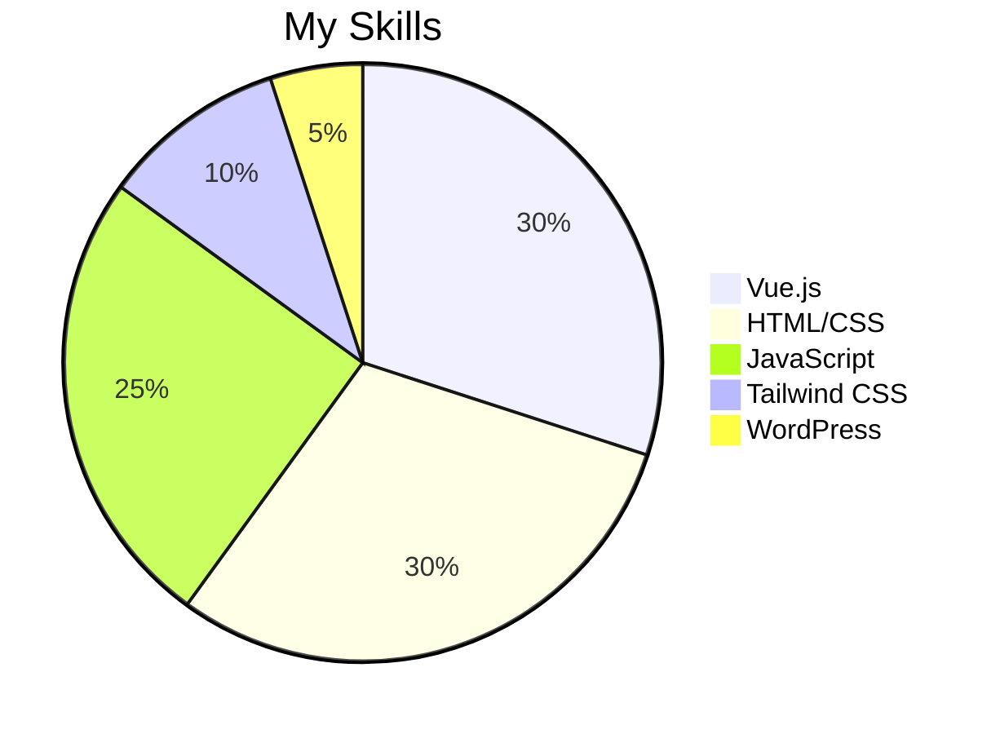

# **💻 > Hey There!, I am AmirAli **  
I am a **front-end developer** with **2 years of experience**, specializing in **Vue.js**, **HTML/CSS**, and **Tailwind CSS**. I enjoy crafting professional and efficient user interfaces and am currently working on projects like **corporate websites** and **management panels**. 🌟  

---

## **👨‍💻 About Me**  
- 🔥 **16 years old** and studying in **technical high school**  
- 🎯 Goal: To deepen and professionalize my web development skills  
- 🌎 Based in **Iran**  
- ☕ A single shot of espresso fuels my daily coding sessions! 😄  
- 📝 Proficient in **English reading and writing**  

---

## **✨ Skills**  
### **Front-End Development**  
- Vue.js  
- Tailwind CSS  
- JavaScript (Frameworks and DOM Manipulation)  
- HTML & CSS (Responsive and professional design)  
- Beginner-level experience with WordPress  

---

## **🛠 Tech Stack**  
- **Languages & Frameworks:**  
  JavaScript, TypeScript, Vue js, Node.js, Three.js , Next.js  
- **Styling:**  
  TailwindCSS, Styled Components, MUI, DaisyUI  
- **Tools & Platforms:**  
  Vite, NPM, Expo, Postgres, MongoDB, Redis, Docker, Kubernetes  
- **Design & Collaboration:**  
  Figma, Jira  
- **Code Quality:**  
  ESLint  

---

## **🏆 Achievements & Projects**  
1. **Corporate Management Panel**  
   - Includes **data tables**, **varied menus**, and **dual-language support**  
   - Professionally structured and user-friendly  

2. **Corporate Website**  
   - Integrated with **API** for dynamic data display  
   - Features a **dynamic news slider** using **Vue.js Swiper**  

3. **Mini Projects:**  
   - **Family Tree**: Designed a tree structure using HTML and CSS  
   - **Responsive News Slider**  

---

## **📊 Skill Statistics**  


---

## **🌐 Language Usage Statistics**  


---

## **📈 Progression Over Time**  
```mermaid
line
    title Development Skills Progression
    xAxis: Time
    series Vue.js,HTML,CSS,JavaScript
    data:
      Vue.js: [0, 10, 20, 30, 40]
      HTML: [20, 30, 40, 50, 60]
      CSS: [15, 25, 35, 45, 55]
      JavaScript: [10, 20, 30, 40, 50]
```

---

## **🌍 Contact Me**  
- **GitHub:** [github.com/Amir3an](#)  
- **Instagram:** [instagram.com/amir_3an](#)  
- **Telegram:** [t.me/Amir3an](#)  

---

## **📈 Future Goals**  
- Mastering **JavaScript Core**  
- Enhancing scalability in web design  
- Contributing to open-source projects to support the developer community  

---

### **License**  
This repository is licensed under the MIT License. For more details, refer to the `LICENSE` file.  
